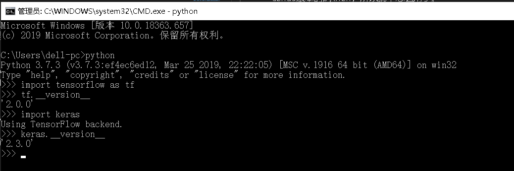
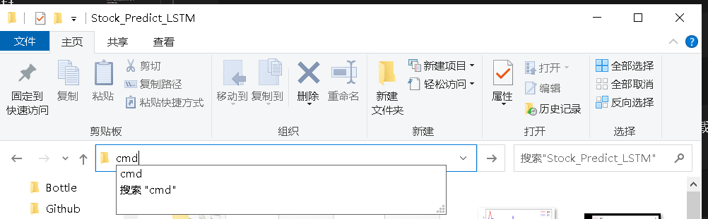
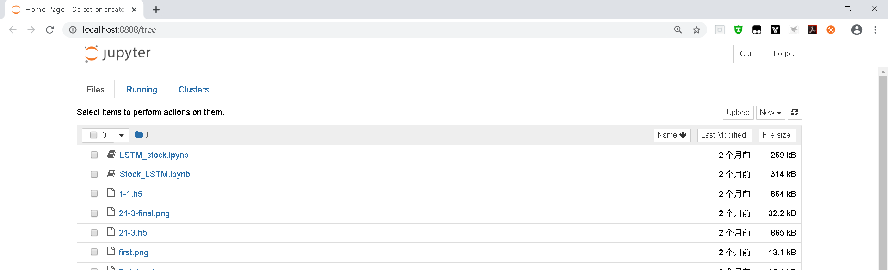
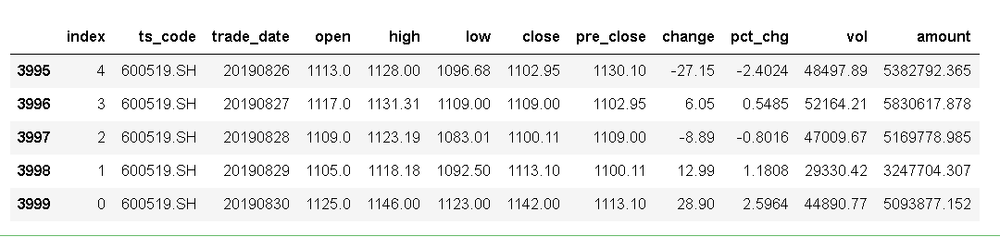
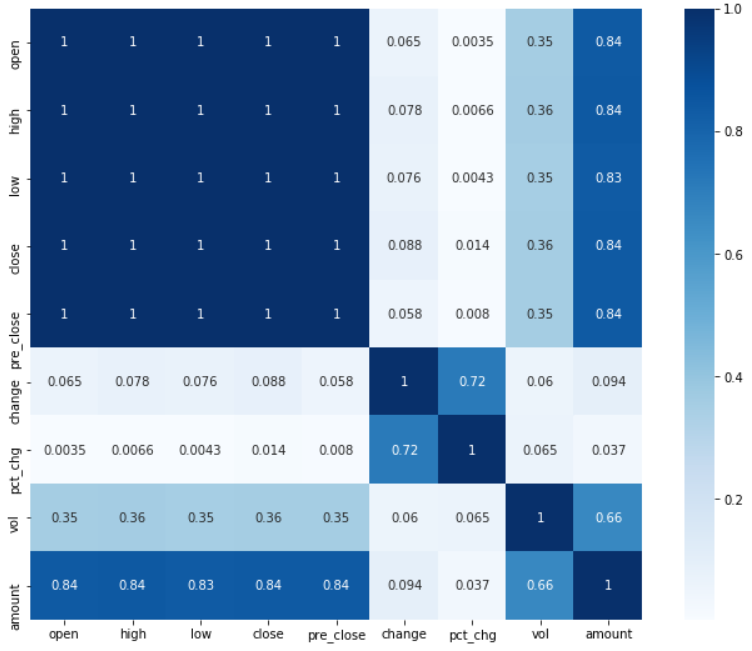
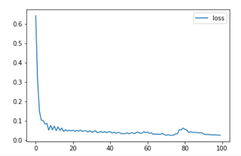
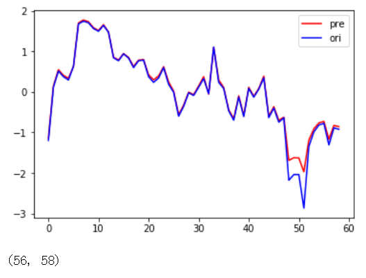
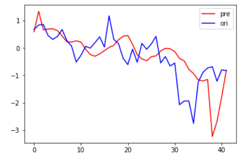

# LSTM长短期记忆人工神经网络------实践

## 3 使用keras LSTM实现股票预测

### 3.1配置Python环境和keras

配置python就不用多讲了，到官网上下载一个就行，现在的电脑基本都用64位的，个人不太喜欢conda版本的python，所以就不怎么用了。

第二个是keras，现在的tensorflow更新2.0版本以后呢就把keras给合并了，但是如果习惯用单独的keras的朋友也不用着急，keras的最后一次发行版本是支持了tensorflow2.0的：

    The current release is Keras 2.3.0, which makes significant API changes and add support for TensorFlow 2.0. The 2.3.0 release will be the last major release of multi-backend Keras. Multi-backend Keras is superseded by tf.keras.

使用keras之前需要先配置tensorflow，keras只是一个高级的API，底层还是需要tensorflow，我一般直接使用pip就能下载，但是有很多人都说pip下不了，大部分情况是网络问题，如果pip不行的话就使用阿里源或者清华源下载，用同样的方法也可以下载keras：

    使用pip直接下载：
    pip install tensorflow==2.0.0
    （用2.1.0是最新版本，如果需要换掉就行）
    pip install keras==2.3.0

    tensorflow pip下载指南：https://tensorflow.google.cn/install/pip
    使用清华源下载tensorflow：https://blog.csdn.net/jdbc/article/details/80969396

如果下载好了，进入python环境引用包就应该会有下图：

查看tensorflow的版本号：

    打开cmd -》输入 python -》输入import tensorflow as tf -》 tf.__version__

查看keras的版本号：

    打开cmd -》输入 python -》输入import keras -》 keras.__version__

如果喜欢的话可以下一个python的IDE，PyCharm我比较喜欢，如果不想用的，可以下载一个jupyter，使用pip下载：

    pip install jupyter notebook

jupyter是一个网页的python编辑器，下载好了在cmd中输入：

    jupyter notebook

打开之后他就会自己弹出一个网页。

### 3.2 使用jupyter进行编辑

一般情况下我喜欢先建一个空的文件夹，然后在这个文件夹里使用jupyter，在文件夹路径的地方输入cmd就可以直接在这个文件夹中编辑：

进入cmd之后输入：

    jupyter notebook

等待网页打开：

打开就是这个样子，然后在右上部有一个new，点击选择python3，就生成了一个可编辑文件了。进入之后就是一行空的，这个就是编辑框：

### 3.3 开始码代码

    有可能用到的库，先用pip下下来：
    pip install pandas  
    pip install numpy
    pip install tushare
    pip install matplotlib
    pip install seaborn
    pip install scikit-learn

首先我这里的股票数据来源是一个叫tushare，这是一个股市数据的分享库，这个是需要申请一个ID的，百度搜一下tushare就行，然后使用他的接口就能得到数据，这里写了一个小类，后面的用处不大，关键是方便：

    import tushare as ts
    import pandas as pd

    class StockData(object):
        def __init__(self):
            self.pro = ts.pro_api('你的ID，your ID')

        # 这里可以自定义开始到结束的时间，还有股票代码，使用的时候设置
        def get_data(self,code, start='19900101', end='20190901'):
            stock_code = self.tran_code(code)
            return self.pro.query('daily', ts_code=stock_code, start_date=start, end_date=end)

        def tran_code(self,code):
            if code[0:1] == '6':
                return code + '.SH'
            else:
                return code + '.SZ'

随便找一只股票获取：

    data_test = stock.get_data("600519", start = '20190901',end = '20191201')

获取到的股票数据有一个pandas的矩阵包裹起来的，可以用data.tail直接查看后面5个数据：

拿到数据之后并不能一开始就直接放入到模型里面了，按照一般的步骤，拿到数据一定要进行数据的处理，数据处理一般有几种，检查相关性，检查有没有坏数据（就是异常的，比如说股市停牌的），还要观察数据，一般情况下，比如说像这次的数据里面，最后的account是成交额，change是变化量，两者都不是一个数量级，这样的数据拿给模型直接进行计算的话，计算量增大了，最后的效果也会很差。

#### 归一化处理

分别采用了三种不同的归一化：

1、以 __close__ 的为标准，参照 __close__ 的 _max_ 和 _min_ 进行归一

2、直接用（-1，1）进行归一

3、采用sklearn的标准归一化进行归一

实践下来采用标准归一化的效果最好

    from sklearn import preprocessing as process
    scaler = process.StandardScaler()
    scaler.fit(X)
    X_scalerd = scaler.transform(X)
    y = pd.DataFrame(X_scalerd)[3].values

#### 相关性

相关性分析主要是确定哪些是主要的数据，相关性高的一些数据可以合并，降维。这样计算量会下来，准确性也会提高。相关性分析一般对于这种维度小的我喜欢直接看图，看热度图：

    import seaborn as sns
    def corr_heat(df):
        df = df.drop(columns = ['index'])
        dfData = abs(df.corr())
        plt.subplots(figsize=(12, 9)) # 设置画面大小
        sns.heatmap(dfData, annot=True, vmax=1, square=True, cmap="Blues")
        # plt.savefig ('./BluesStateRelation.png')
        plt.show()

    corr_heat(data)

这样就会出来这么一张图：

这就是各个变量相关系数的的热度图，从图上就可以看出来，数据有三个比较明显的分区，也就是这三个区的相关性很强，可以视作一个变量使用。

这里使用降维的方法的话我试了一下PCA的方法，但是训练的结果不太好，所以我就放弃了， 使用人工的方法选出了三个变量，但是大家实际的时候可以根据实际情况来，用PCA之类的数据降维的方法才是比较正规的、科学的。

#### 构建模型

第一步吧要用到的接口进行引用一下：

    from keras.models import Sequential
    from keras.layers.core import Dense, Dropout, Activation
    from keras.layers.recurrent import LSTM
    from keras.models import load_model
    from keras.layers import RepeatVector
    import keras

在这里参考了很多网上的教程，很多人选择了双层的LSTM结构，但是我的实际操作下来结果并不好，所以我就采用了下面的这个结构：

    model = Sequential()

    model.add(LSTM(128, input_shape=(X_train.shape[1], X_train.shape[2]), return_sequences=True))

    model.add(Dense(16,kernel_initializer="uniform",activation='relu'))        
    model.add(Dense(1,kernel_initializer="uniform",activation='linear'))
    
    adam = keras.optimizers.Adam(decay=0.2)
    model.compile(loss='mae', optimizer='adam', metrics=['accuracy'])
    model.summary()

keras并不能只用一层LSTM就满足我们想要的一对一多对多这样的输出，根据需求的不同可以改变后面的全连接层（Dense）的输入输出。

最后训练模型：

    # 训练模型
    print(X_train.shape, y_train.shape)
    history = model.fit(X_train, y_train, epochs=100, verbose=2, shuffle=False)

    model.save("1-1.h5")

得出的损失函数是这样的，最后的损失值降到了0.0255，还是很不错的。

    # plot history
    plt.plot(history.history['loss'], label='loss')
    #plt.plot(history.history['accuracy'], label='train')
    plt.legend()
    plt.show()

下一步进行预测：

    pre_test = model.predict(X_test_scalerd)

    pre_test = pre_test.reshape(pre_test.shape[0])

    plt.plot(pre_test, label='pre', color='red')
    plt.plot(y_test, label='ori', color='blue')
    plt.legend()
    plt.show()

将后三十天的数据进行预测，得到了一个和真实数据差不多的，还是很不错的：

这里使用一对一的方法来进行预测的，效果还行，后来我又改变了一下，做了一个21天对3天的，实际的效果一般：

网络结构：

    model = Sequential()

    model.add(LSTM(128, input_shape=(X_train_B.shape[1], X_train.shape[2])))
    #model.add(Dropout(0.5))

    model.add(RepeatVector(1))

    model.add(Dense(16,kernel_initializer="uniform",activation='relu'))
    model.add(Dense(3,kernel_initializer="uniform",activation='linear'))
    
    adam = keras.optimizers.Adam(decay=0.5)
    model.compile(loss='mae', optimizer='adam', metrics=['accuracy'])
    model.summary()

效果：

其实仔细看的话是能看出大致的波动的，只不过有一点延后，幅度也不准确。