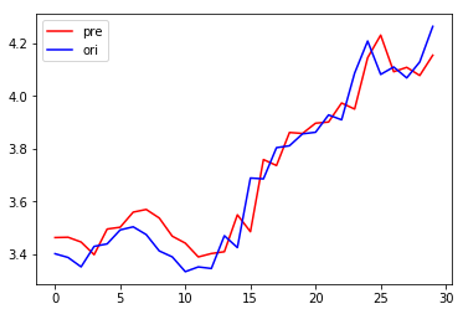
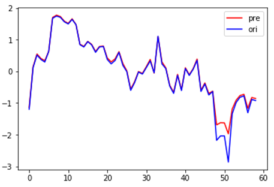
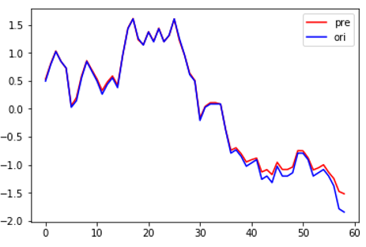
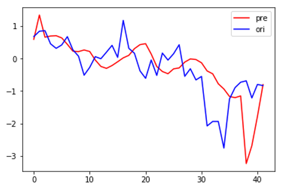

### 使用单层的LSTM网络实现对中国股票市场的预测，使用股票市场中的其中一只作为训练模型，并对别的股票进行预测，一天对一天模型：趋势预测率达到**90%**

### Using the single-layer LSTM network to predict the Chinese stock market, using one of the stock market as a training model and forecasting other stocks, one day to one day model:the trend prediction rate reaches **90%**

<!-- GFM-TOC -->
* [代码： Code](/Code)
* [LSTM学习过程：Learning process of LSTM](/Learning)
<!-- GFM-TOC -->

# 结果：
# Result:

## 一天对一天模型：
## one day to one day model:

用训练集后30天预测：

predic using the last 30 days in train set:

用最近30天预测：

predic using the recent 30 days:

用别的股票最近30天预测：

predic using the recent 30 days of another stock:

## 21天对3天的模型（非常不理想）:
## 21 days to 3 days model(terrible):

predic using the recent 30 days of another stock:

