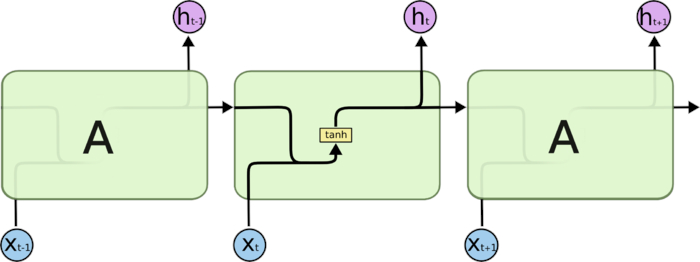
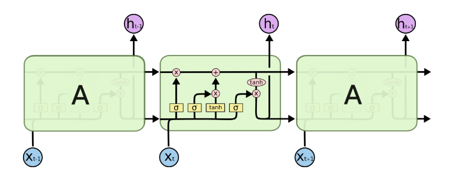

# LSTM长短期记忆人工神经网络------理论学习

直接看代码走这儿：
<!-- GFM-TOC -->
* [代码 Code](/Code)
<!-- GFM-TOC -->
    
    长短期记忆网络（LSTM，Long Short-Term Memory）是一种时间循环神经网络，是为了解决一般的RNN（循环神经网络）存在的长期依赖问题而专门设计出来的，LSTM适合于处理和预测时间序列中间隔和延迟非常长的重要事件。

LSTM是一种RNN模型的改良版本，RNN是一种对于序列数据特别友好的模型，在时间序列数据上表象尤其有优势。所以看来要弄懂LSTM，那就必须得先弄懂RNN模型

## 一、RNN模型

这里借用一张网络上的RNN都会配的一张图：

- **x-输入 h-隐含层（阀值） o-输出 y-实际值 L-损失函数（与实际的差值）**

对于我个人而言，RNN网络（这里是说一层网络或多层中的某一层）其实可以看作是一种线性的网络，他的网络复杂度和单层神经网络（也就是感知器）差不多，图中的左边是折叠的RNN模型，但从这样来看并没有什么关键的点，所以直接看右边的一部分。

从右边的图其实就可以很直接地看出这种模型为什么很适合线性的数据了。简要的说一下这种模型，我们都知道普通的神经网络，值的传递方向一般都是单向传递，而RNN的模型中，引入了单层之间的影响，暂且不看输入层的权值**U**和输出的的权值**V**，但看隐含层的函数。以 **h(t)** 为例：

这一个单元的值就来至于上一次的输入值 **x(t-1)** 产生的的 **h(t-1)** 的值和提前规定的权值 **W** ，这样一来我们的神经元就受到了来自之前数据的影响，这样一来，RNN基本的思路就能体现出来了，从这一步也能够很好的理解为什么时间序列的数据会那么友好了。

接着我们就可以写出我们的输出值的一般公式了：

当然在实际的建模过程中我们还会给，加入权值的那一步加上一个激活函数，一般情况下，得到 **h(t)** 会采用 **tanh** 函数，**c** 为偏置。到最后会有在有一定基础的情况下，能够得到一定的偏差函数（也就是上文提到了 **L(t)**）， 我们还会给 **y(t)** 加上一个激活函数，一般情况下会采用 **softmax** 函数，而偏差就来于训练产生的 **L(t)**。

形象的看RNN就是这样的一个结构：

而RNN可能还会出现以下的几种输出情况：

#### 单输入对单输出：这种情况是最普通的情况
#### 多输入单输出：用多个数据输出一个结果，可以用来做特征提取
#### 单输入多输出：预测，单对多，一般准确率不会太高（猜测）
#### 多输入多输出：预测，实际的效果没有单对单的效果好

### 至此，RNN的基本思路就理解了，对于偏差函数L(t)的求解，参考【1】里面有一段数学的推导，有时间可以看一看。下一步可以来理解LSTM了

## 二、LSTM

通过RNN的数学推导，其实我们很容易可以看出，每一层的 **h** 对下一层的影响是经过一定的函数变化的，但是对于之后的可能在几十层甚至十几层的时候，很前面的某一层的影响就会非常非常的小，这样的过程被可以 **看作是** 一种 **梯度消失** （这里和世界网络训练中的梯度消失不一样，这里只是我用来描述这种长期记忆消失的），对于长序列的数据，前边的数据对后边的数据影响在经过每一次单一函数的转换之后变得非常的小，所以说就提出了LSTM这种RNN的改进版本。

相比于RNN，我们可以直接看出，LSTM最大的不同有两个点，一个是在数据函数化处理的过程中加入了很多函数，过程也更复杂，另一点也是非常中要的一点，对于同一层之间的数据，原本的RNN只向下一个cell传递了一个值（也就是 **h** ，在图中也就是横向传递的下面那一条线，其值为 **h(t-1)**，上一个cell的输出值），但是在LSTM中多了另一个值，横向传递的上面那一条线，这就是所谓的长期记忆的（设为 **c**），可以看到 **c** 在一个细胞中对这一个cell的输出的影响在最后输出 **h** 的时候，长记忆的作用就是决定这一个cell是否应该被遗忘，可以看到这个 **c** 的值是一直贯通了整个网络，所以说这就能解决普通的RNN存在的后面的cell无法和最前面的cell进行交流的。

## 2.1 LSTM的处理过程

模型里面的三个门：输入门、遗忘门、输出们，这三个门直接从字面上理解就没问题。 

这里还得说一句，下面的所有公式里面都会有 **[ ]** 包裹起来的，这个意思表示的是函数的意思大家应该都知道，而这里表示的这个函数其实是一个加法的公式。如果要细究的话可以看看引用里的【2】

#### 2.1.1 第一步：遗忘门

简而言之，遗忘门就是之前的cell的状态要不要忘记，由这一个细胞的输入和上一个细胞的输出共同决定，之前的长记忆要不要被忘记。

遗忘门有两个输入，上一个cell的结果 **h(t-1)**，和当前的输入 **x(t)** ，变换公式在上图右边，用一个sigmoid决定是否遗忘，这个很简单，因为sigmoid层的输出是0-1的值，这代表有多少信息能够流过sigmoid层。0表示都不能通过，1表示都能通过，sigmoid的取值负数基本上就等于0了，0就是没有，那就忘了，过掉。

这里要注意这个门的输出到长记忆里就是相乘，所以他才能实现是否遗忘的功能，0-1之间的乘法这个大家都知道，就不说了。

#### 2.1.2 第二步：输入门

输入门负责的是将当前cell的数据进行处理的，用两个门来进行处理，一个sigmoid和一个tanh。这里为什么会有两个函数呢，这里就要说说这两个函数的不同点，从图像看这两个函数其实是差不多的，但是从取值来看，sigmoid函数在负无穷的时候会等于0，而tanh的负无穷等于-1，从数学上来看，等于0就是没有了，但是等于-1代表的是相反的意思。所以在这里的这两个函数可以这样理解：当前的数据需要被记下的有多少和和当前的信息是多少。

#### 2.1.3 第三步：更新细胞状态

最开始是遗忘门，之前的细胞状态该不该被遗忘，通过一个乘法实现。下一步是当前这个细胞的信息要不要记录到当前的长记忆中，通过上一步的两个门就实现了，加法加到长记忆中即可。

#### 2.1.4 第四步：输出门

输出门有两个数据来源，一个是当前细胞的数据，用一个sigmoid函数求得，然后是长记忆，用tanh求得，相乘之后输出。

    最后还得说一说，这里都是简单讲了流程，要论数学推导的话还是得去【2】里面看一看，【2】里面的公式是一种LSTM的变形，但是大致的都差不多。

# 【Reference】
【0】（最重要）LSTM详解（里面讲得很仔细，有很多动图帮助理解，还讲了GRU），https://towardsdatascience.com/illustrated-guide-to-lstms-and-gru-s-a-step-by-step-explanation-44e9eb85bf21

【1】RNN，https://blog.csdn.net/zhaojc1995/article/details/80572098

【2】LSTM的数学推导，https://blog.csdn.net/a635661820/article/details/45390671

【3】Sigmoid函数图像：

【4】tanh函数图像：

